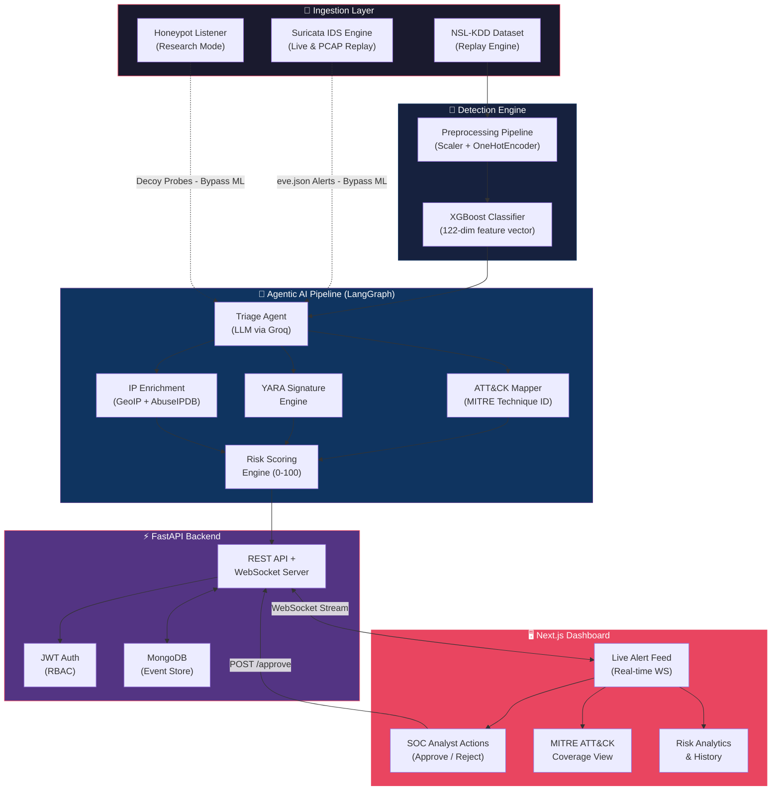

# 🛡️ SentinelAI

**An Agentic AI-Based Alert Triage & Response Assistant for Network Security**

[](https://github.com/Yateesh0313/-SentinelAI-An-Agentic-AI-Based-Alert-Triage-and-Response-Assistant-for-Network-Security/actions/workflows/ci.yml)
[](LICENSE)
[](https://python.org)
[](https://nextjs.org)

> SentinelAI autonomously triages network intrusion alerts using an agentic AI pipeline—detecting anomalies with XGBoost, enriching context with MITRE ATT&CK mapping, YARA signature matching, and IP reputation, then presenting risk-scored alerts to SOC analysts for human-in-the-loop approval—reducing mean-time-to-respond from hours to seconds.

**Basaveshwar Engineering College (Autonomous), Bagalkote**  
**Department of Computer Science & Engineering | Final Year B.E. Major Project | VTU 2027**  
📄 **Academic Documentation**: [Project Synopsis (Markdown)](docs/SentinelAI_Project_Synopsis_Updated.md) • [Project Synopsis (PDF)](docs/SentinelAI_Project_Synopsis_Updated.pdf) • [Team Contributions Matrix](TEAM_CONTRIBUTIONS.md)

---

## 📋 Problem Statement

Modern Security Operations Centers (SOCs) are overwhelmed. Industry research consistently reports:

- **11,000 alerts/day** hit the average SOC, and analysts can only investigate a fraction (Devo, 2022 *SOC Performance Report*).
- **45% of daily alerts are false positives**, with some organizations reporting rates as high as 80% (Ponemon Institute, 2019 *The Cost of Malware Containment*).
- **SOC analyst burnout and turnover** exceeds 65%, driven directly by alert fatigue (SANS 2023 *SOC Survey*).
- **Mean time to detect (MTTD)** a breach is **204 days** and mean time to contain is **73 days** (IBM, 2023 *Cost of a Data Breach Report*).

Manual alert triage is the bottleneck. SentinelAI automates the first 90% of triage work—classification, enrichment, context gathering, risk scoring—and surfaces only decision-ready alerts to human analysts, preserving the critical human-in-the-loop for approve/reject/investigate actions.

---

## 🏗️ Architecture



### 🔍 Detection Architecture: Why Suricata over Zeek?

A critical architectural decision in SentinelAI is utilizing **Suricata** rather than Zeek for live intrusion detection telemetry. While Zeek (formerly Bro) is a premier framework for deep protocol analysis and passive network metadata extraction (`conn.log`), it is forensic and descriptive rather than an active intrusion detection classifier—attempting to infer live attacks from connection metadata requires fragile, lossy heuristic approximations (e.g. mapping 12 of 41 NSL-KDD features). In contrast, **Suricata** is an industry-standard, multi-threaded signature-based Intrusion Detection System (IDS). Its structured `eve.json` alert stream delivers real-time, pre-classified detections with explicit signature IDs (SIDs), standardized categories (e.g. *Web Application Attack*, *Attempted Information Leak*), and calibrated severity tiers from the **Emerging Threats Open ruleset (47,000+ signatures)**. Because Suricata alerts represent high-confidence signature detections by definition, SentinelAI routes them directly into the **LangGraph agentic triage pipeline** (alongside honeypot decoy probes), bypassing statistical ML classification and freeing the AI agents to focus immediately on threat intelligence enrichment, MITRE ATT&CK correlation, and analyst action recommendations.

---

## 🛠️ Tech Stack

| Layer | Technology | Purpose |
|-------|-----------|---------|
| **Frontend** | Next.js 16, React 19, TypeScript, Tailwind CSS, shadcn/ui, Framer Motion, Three.js, GSAP | Production SOC dashboard (shadcn/ui + Framer Motion) with cinematic 3D landing page (GSAP + Three.js) |
| **Backend** | FastAPI, Uvicorn, WebSockets | REST API, real-time event streaming, JWT auth |
| **Agentic AI** | LangGraph, LangChain, Groq (LLM) | Multi-agent triage pipeline with tool-calling |
| **ML Detection** | XGBoost, scikit-learn | Anomaly classification on NSL-KDD (122 features) |
| **Threat Intel** | MITRE ATT&CK heuristics, YARA rules, AbuseIPDB, GeoIP | Contextual enrichment and signature matching |
| **IDS Engine** | Suricata 7.0, Emerging Threats Open | Live capture & PCAP replay signature detection (47,000+ rules) |
| **Risk Engine** | Custom 5-signal weighted formula | Deterministic 0–100 risk scoring with classification |
| **Database** | MongoDB 7 (Motor async driver) | Persistent event store with atomic state transitions |
| **Auth** | JWT + bcrypt (RBAC) | Role-based access with double-approval guards |
| **CI/CD** | GitHub Actions | Automated test suite on every push |
| **R&D (Comparative)** | PennyLane VQC (Quantum) | Documented quantum-classical comparison study |

---

## 🚀 Quick Start

### Prerequisites

| Tool | Version | Notes |
|------|---------|-------|
| Python | 3.10+ | Core backend and ML |
| Node.js | 18+ LTS | Frontend build |
| MongoDB | 7+ | Via Docker or local install |
| Docker | 20+ | (Optional) For `docker compose up` |
| Suricata | 7.0+ | (Optional) For Research Mode live capture & PCAP replay |

### 1. Clone & Install

```bash
git clone https://github.com/Yateesh0313/-SentinelAI-An-Agentic-AI-Based-Alert-Triage-and-Response-Assistant-for-Network-Security.git
cd SentinelAI
```

### 2. Start MongoDB

```bash
docker compose up -d
```

### 3. Backend

```bash
cd backend
pip install -r requirements.txt
uvicorn main:app --reload          # → http://127.0.0.1:8000
```

### 4. Agents (Agentic AI Pipeline)

```bash
cd agents
pip install -r requirements.txt
# Set GROQ_API_KEY in agents/.env
```

### 5. Frontend

```bash
cd frontend
npm install
npm run dev                        # → http://localhost:3000
```

### 6. Seed the Dashboard (One Command)

Instead of waiting for replay to trickle in events, instantly populate a judge-ready SOC dashboard:

```bash
python scripts/seed_demo.py
```

This runs **28 curated KDDTest+ events** through the **full real pipeline** (XGBoost detection → LLM triage → ATT&CK mapping → YARA signatures → IP enrichment → risk scoring) and writes them to MongoDB with realistic staggered timestamps across the last hour. The dashboard shows:

- **24 pending alerts** across Critical, High, Medium, and Low severities
- **4 resolved events** in History (approved, rejected, investigating, false positive)
- **Full MITRE ATT&CK coverage** (T1498, T1046, T1041, T1071, T1068)
- **Risk distribution** across LOW / MEDIUM / HIGH / CRITICAL

Open **http://localhost:3000/dashboard** — everything is populated on first load. Live replay continues to work seamlessly on top of seeded data.

---

## 🧪 Testing

Run the complete reliability test suite with a single command:

```bash
python -m pytest tests/ -v
```

**33 tests** across 7 modules covering the highest-risk logic:

| Module | Tests | Coverage |
|--------|-------|----------|
| `test_preprocessing.py` | 5 | Scaler/encoder shape (41→122 dims), train/test alignment, unseen category tolerance |
| `test_risk_scoring.py` | 6 | Weight sum = 1.0, classification boundaries (LOW/MEDIUM/HIGH/CRITICAL), edge cases |
| `test_approval_guard.py` | 2 | Atomic state transitions, 409 Conflict on double-approve and cross-action |
| `test_matchers.py` | 9 | ATT&CK heuristics (T1498, T1046, T1110, T1041), YARA signatures, true negatives |
| `test_suricata.py` | 6 | Suricata subprocess manager, eve.json alert parser, severity mapping, risk scoring, live replay |
| `test_integration.py` | 1 | Full lifecycle: detect → triage → risk score → approve → schema validation |
| `test_frontend_smoke.py` | 4 | Next.js production build verification for `/`, `/dashboard`, `/login` |

---

## 🎬 Demo

<!-- 
📹 Replace the placeholder below with your actual demo recording:

-->

> **Demo video/GIF coming soon.** The dashboard showcases real-time alert streaming with shadcn/ui and Framer Motion, interactive triage cards with animated collapsible disclosure, MITRE ATT&CK badges, one-click SOC analyst actions (approve/reject/investigate), and a risk-scored analytics overview.

---

## 🗺️ Roadmap

SentinelAI ships in **Demo Mode** by default—a hardened, dataset-driven configuration optimized for reliable presentations and evaluation. Setting `RESEARCH_MODE=true` in `backend/.env` re-enables all experimental features without code changes: **live packet capture & IDS** (Suricata 7.0 with Emerging Threats Open signatures on loopback, plus PCAP replay), **honeypot listener** (deception-based threat detection), and the **quantum VQC comparison study** (PennyLane variational quantum classifier benchmarked against XGBoost). These are documented as a Comparative R&D Study, not production features. Looking forward, realistic production upgrades include: **Apache Kafka ingestion** for high-throughput event streaming at enterprise scale, **horizontal auto-scaling** of the detection and agentic pipeline behind a load balancer, **multi-tenant deployment** with isolated databases and per-organization RBAC policies, **SOAR integration** (Splunk SOAR / Palo Alto XSOAR) for automated playbook execution on approved actions, and **continuous model retraining** with drift detection on live traffic distributions.

---

## 📂 Project Structure

```
SentinelAI/
├── backend/              # FastAPI REST API + WebSocket server
│   ├── main.py           # Core API: /detect, /triage, /approve, /reject, /events, /suricata
│   ├── risk_scoring.py   # 5-signal weighted risk engine (0–100)
│   ├── enrichment.py     # IP geolocation + AbuseIPDB reputation
│   ├── auth.py           # JWT authentication + RBAC
│   ├── database.py       # MongoDB async operations (Motor)
│   └── requirements.txt
├── agents/               # LangGraph agentic AI pipeline
│   ├── pipeline.py       # Multi-node: triage → severity → action recommendation
│   ├── attack_mapping.py # MITRE ATT&CK technique mapping heuristics
│   └── requirements.txt
├── ml/                   # Machine learning models
│   ├── classical/        # XGBoost baseline (production model)
│   ├── quantum/          # PennyLane VQC (R&D comparison)
│   ├── signatures/       # YARA rule definitions
│   ├── honeypot/         # Honeypot listener (Research Mode)
│   ├── live_capture/     # Suricata IDS ingestor + PCAP replay
│   └── data/             # NSL-KDD dataset + processed artifacts
├── frontend/             # Next.js 16 + React 19 dashboard
│   └── src/
│       ├── app/          # Pages: homepage, dashboard, login
│       ├── components/   # UI components (shadcn/ui Button, Card, Badge, Collapsible + 3D Hero)
│       └── hooks/        # Custom hooks (WebSocket, auth)
├── docs/                 # Major project synopsis & academic documentation
│   ├── SentinelAI_Project_Synopsis_Updated.md
│   ├── SentinelAI_Project_Synopsis_Updated.pdf
│   └── contributions/    # Individual member architectural role specifications
│       ├── CONTRIBUTION_YATEESH.md
│       ├── CONTRIBUTION_SOMASHEKHAR.md
│       ├── CONTRIBUTION_PRAVEEN.md
│       └── CONTRIBUTION_DILIP.md
├── scripts/
│   └── seed_demo.py      # One-command judge demo seed (28 events)
├── tests/                # pytest test suite (33 tests)
├── .github/workflows/    # CI pipeline (GitHub Actions)
├── docker-compose.yml    # MongoDB service
├── TEAM_CONTRIBUTIONS.md # Comprehensive 4-member architectural matrix
├── CONTRIBUTING.md       # Team contributions index
├── LICENSE               # MIT License
└── README.md
```

---

## 👥 Team & Architectural Contributions

**Basaveshwar Engineering College (BEC), Bagalkote**  
**Department of Computer Science & Engineering | Final Year B.E. | VTU 2027**

> 📄 For the full team architectural breakdown, see **[TEAM_CONTRIBUTIONS.md](TEAM_CONTRIBUTIONS.md)**.

| Team Member | USN | Core Domain & Focus | Key Modules & Responsibilities | Branch | Detailed Role Doc |
|---|---|---|---|---|---|
| **Yateesh Mattur** | `2BA23CS125` | **Agentic AI & LLM Orchestration** | LangGraph multi-agent pipeline (`pipeline.py`), Groq LLM integration (Qwen 2.5 / Llama 3), Triage → Severity → Response agent reasoning nodes, MITRE ATT&CK heuristics mapping (`attack_mapping.py`), agent test suite | [`Yateesh0313-patch-1`](https://github.com/Yateesh0313/-SentinelAI-An-Agentic-AI-Based-Alert-Triage-and-Response-Assistant-for-Network-Security/tree/Yateesh0313-patch-1) | [Role Spec](docs/contributions/CONTRIBUTION_YATEESH.md) |
| **Somashekhar Kadrolli** | `2BA23CS101` | **ML & Quantum Detection** | NSL-KDD dataset preprocessing pipeline (41→122 features with Scaler & OneHotEncoder), XGBoost & Random Forest classical anomaly detection classifiers, PennyLane Variational Quantum Classifier (VQC) comparative study | [`Somashekhar`](https://github.com/Yateesh0313/-SentinelAI-An-Agentic-AI-Based-Alert-Triage-and-Response-Assistant-for-Network-Security/tree/Somashekhar) | [Role Spec](docs/contributions/CONTRIBUTION_SOMASHEKHAR.md) |
| **Praveen Nashi** | `2BA23CS071` | **Backend & Cybersecurity Integrations** | FastAPI REST & WebSocket streaming architecture (`main.py`), MongoDB async persistence (Motor), JWT authentication & RBAC security (`auth.py`), 5-signal weighted risk scoring engine (`risk_scoring.py`), IP reputation & GeoIP enrichment, YARA signatures, Suricata 7.0 IDS integration, honeypot deception module | [`Praveen-Nashi`](https://github.com/Yateesh0313/-SentinelAI-An-Agentic-AI-Based-Alert-Triage-and-Response-Assistant-for-Network-Security/tree/Praveen-Nashi) | [Role Spec](docs/contributions/CONTRIBUTION_PRAVEEN.md) |
| **Dilip Holkar** | `2BA24CS402` | **Frontend, UI/UX & Deployment** | Next.js 16 + React 19 SOC dashboard (`dashboard/page.tsx`), shadcn/ui components (`button.tsx`, `collapsible.tsx`), Framer Motion interactive cards, Three.js & GSAP 3D network landing page, real-time WebSocket hook (`use-sentinel-ws.ts`), Docker containerization (`docker-compose.yml`), GitHub Actions CI/CD (`ci.yml`) | [`Dilip`](https://github.com/Yateesh0313/-SentinelAI-An-Agentic-AI-Based-Alert-Triage-and-Response-Assistant-for-Network-Security/tree/Dilip) | [Role Spec](docs/contributions/CONTRIBUTION_DILIP.md) |

---

## 📜 License

This project is licensed under the [MIT License](LICENSE).

Copyright © 2026 SentinelAI Team — Yateesh Vijaykumar Mattur, Somashekhar Kadrolli, Praveen Nashi, Dilip Holkar


